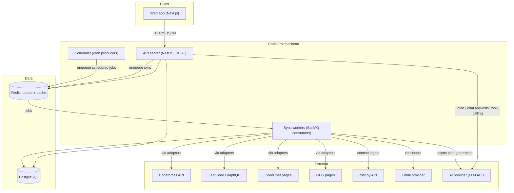
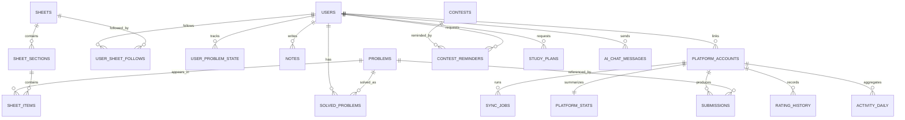
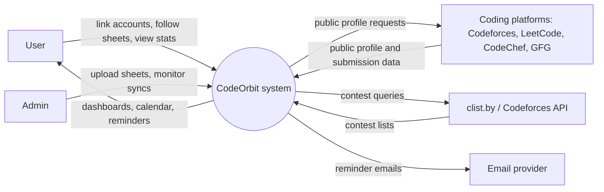
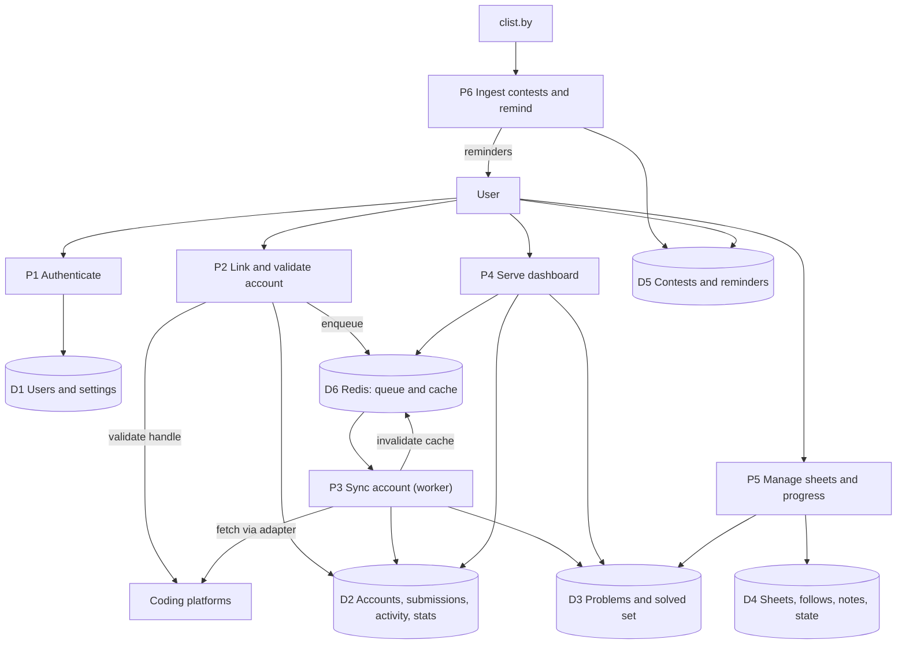
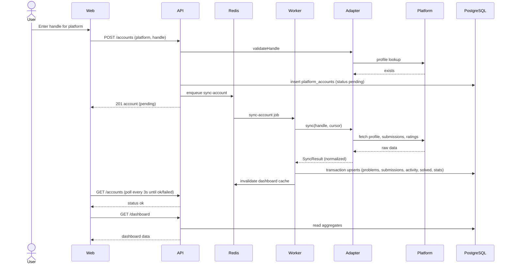
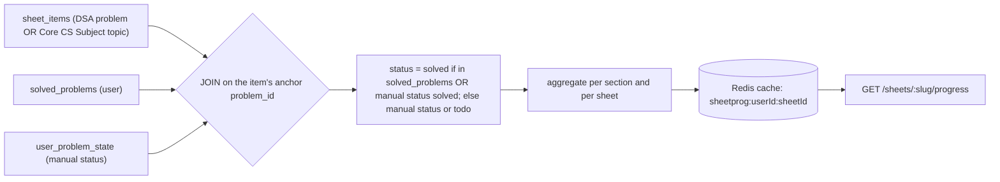
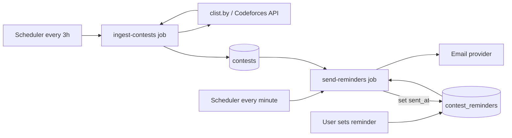
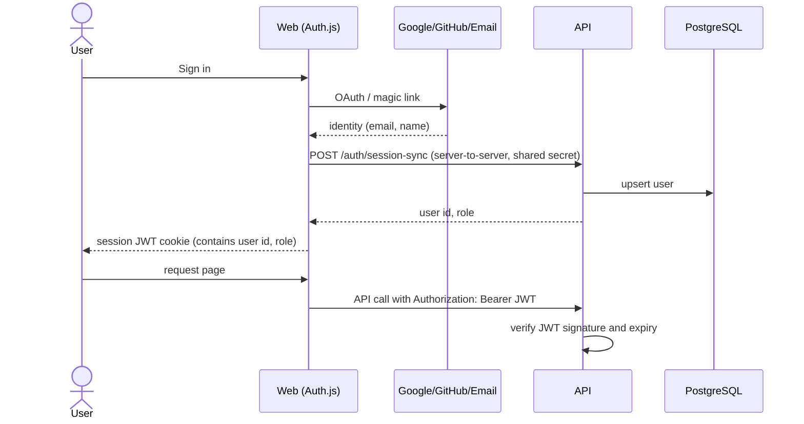
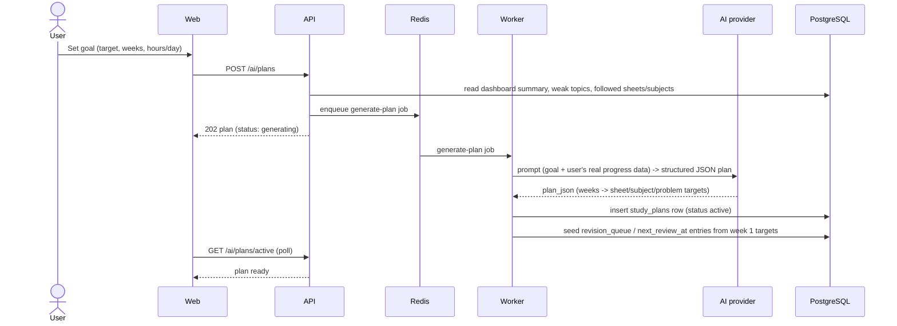
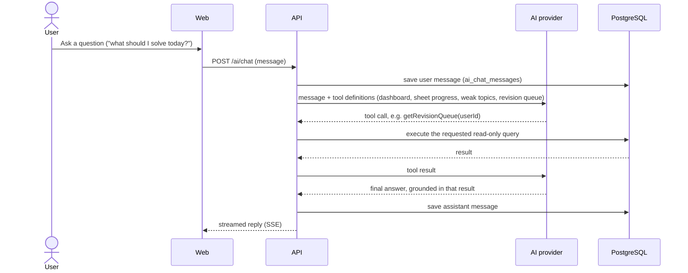

# CodeOrbit — Product Requirements Document (PRD)

| Field | Value |
|---|---|
| Product | **CodeOrbit** — a unified coding-progress tracker and DSA-prep platform |
| Document version | 2.0 (draft) — adds Core CS Subjects and the AI Planner/Assistant |
| Date | 2026-09-23 |
| Status | Ready for build planning |
| Audience | Developers, AI coding assistants, non-technical stakeholders, reviewers |

---

## 0. How to use this document (read first — for humans and AI assistants)

This PRD is written to be **self-contained**. An AI assistant that has never seen this project should be able to read it top to bottom and build the product phase by phase.

### 0.1 Conventions
- **MUST / SHOULD / MAY** follow RFC 2119 meaning. MUST = required for the phase it belongs to.
- Requirement IDs: `FR-x.y` (functional), `NFR-x` (non-functional). Phase tags: **P0** (setup), **P1** (MVP), **P2** (sheets and revision), **P3** (growth), **P4** (intelligence and extras).
- Diagrams are written in **Mermaid** (text-based, readable by both humans and AI). Code blocks are normative unless marked "example".
- "Platform" means an external coding site (LeetCode, Codeforces, CodeChef, GeeksforGeeks). "Sheet" means a curated ordered list of DSA problems (e.g., Blind 75).

### 0.2 Rules for an AI assistant building from this PRD
1. **Build one phase at a time**, in the order in Section 15. Do not start a later phase until the current phase's acceptance criteria pass.
2. **Follow the chosen tech stack (Section 6).** Do not swap frameworks or add heavy libraries without stating why.
3. **Never invent external API details.** Section 8 lists the *expected* upstream endpoints, but unofficial endpoints change. Before coding an adapter, verify the endpoint with a real request and record a sample response in `packages/adapters/<platform>/__fixtures__/`. If it differs from this PRD, follow reality and note it in `docs/DECISIONS.md`.
4. **Isolate platform code.** All upstream access lives behind the `PlatformAdapter` interface (Section 8.3). No platform-specific code in API routes, UI, or the database layer.
5. **Never store or request users' platform passwords, cookies, or session tokens.** Only public handles/usernames.
6. **Validate all input** with Zod at API boundaries. Use the standard error format in Section 10.1.
7. **Write tests for each task** (see Section 16). A task is done only when its acceptance criteria are met and tests pass.
8. **If a requirement is ambiguous, choose the simplest option that satisfies the acceptance criteria**, record the decision in `docs/DECISIONS.md`, and continue.
9. Keep secrets in environment variables (Appendix A). Never commit them.

### 0.3 Document map
1. Overview · 2. Scope and phases · 3. Functional requirements · 4. Non-functional requirements · 5. Architecture · 6. Tech stack and repo layout · 7. Data model · 8. Platform integration spec · 9. Data flow diagrams · 10. API spec · 11. Frontend spec · 12. Sheets spec · 13. Feasibility · 14. Roadmap and phases · 15. Building instructions · 16. Testing · 17. Deployment · 18. Security, privacy, legal · 19. Risks · 20. Open questions · 21. Glossary · Appendices

---

## Plain-Language Overview (For Everyone)

*This section explains the whole project without technical jargon. Skip to Section 1 if you want the formal version.*

**What CodeOrbit is.** CodeOrbit is a website where a coder connects their accounts from LeetCode, Codeforces, CodeChef, and GeeksforGeeks and sees everything in one place — total problems solved, ratings, a streak calendar, and upcoming contests. On top of that, users can follow **study sheets**: curated problem lists (like "Blind 75"), and also **Core CS Subject sheets** (Operating Systems, DBMS, Computer Networks, and so on) where each topic has a video lecture and a checkbox to mark it done. CodeOrbit also includes an **AI Planner** that builds a personalized week-by-week study plan, and an **AI Assistant** — a chat helper that only answers using the user's own real progress data, and gives hints instead of full solutions.

**Why build it.** Today a coder's progress is scattered across four or five different sites, sheets are ticked off by hand in a spreadsheet, and there's no single place that says "here's what to do next." CodeOrbit solves all three at once.

**Who it's for.** Mainly students preparing for placement interviews, plus competitive programmers who want their ratings and contests in one place, and later, mentors or college placement cells who want to see a whole batch's progress.

**How it works, simply.**
```
 You (browser/phone)
        │
        ▼
   CodeOrbit Website  ──────►  CodeOrbit's own database (all your stats live here)
        │
        ▼
  Background "sync workers" quietly visit LeetCode, Codeforces, etc. every
  few hours, pull your latest activity, and update your dashboard.
```
The website itself never talks to LeetCode or Codeforces directly — a separate background process does that on a schedule, so the site stays fast and one broken platform never slows down the rest. For AI features, CodeOrbit sends only the user's own CodeOrbit data (never platform passwords, which CodeOrbit never stores at all) to an AI service to generate plans and chat answers.

**Is it realistic to build?** Yes. Codeforces has an official public way to get data, which is very reliable. LeetCode doesn't, so CodeOrbit uses the same public data the LeetCode website itself uses — this works but takes a little longer to build a complete picture of every solved problem, so manual "mark as done" fills the gap. CodeChef and GFG are the least reliable sources and are treated as best-effort, each independently switchable off if it breaks, without affecting the rest of the site. A small team can realistically build a working first version in 5–7 weeks, with sheets, Core CS Subjects, and revision features following in another 5–6 weeks. Running cost starts near free and grows to roughly $80–200/month at a few thousand users; the AI features add a small additional per-use cost.

**What CodeOrbit will not do.** No code editor or judge — CodeOrbit tracks progress on other platforms, it doesn't run code. No passwords are ever stored for any linked platform. No social feed or forums. The AI assistant never writes a full solution to a problem — only hints and study plans, because giving full answers away would defeat the point of an interview-prep tool.

**Build order, in plain terms.**
| Stage | What gets built |
|---|---|
| 1. Foundation | Basic website, login, database |
| 2. Core tracker (MVP) | Connect accounts, dashboard, heatmap, graphs, contest calendar |
| 3. Sheets | DSA sheets, Core CS Subjects, notes, revision system |
| 4. Growth | Public profiles, goals, friends, leaderboards |
| 5. AI + advanced | AI planner, AI assistant, mentor/college dashboards |

Each stage is a fully working product on its own — the project doesn't need to finish every stage to be useful.

---

## 1. Overview

### 1.1 Product summary
CodeOrbit lets a coder connect their profiles from multiple competitive-programming and DSA-practice platforms and see **one unified view of their progress**: total problems solved, ratings, a combined activity heatmap, topic and difficulty breakdowns, and upcoming contests in a single calendar. Users can also **follow curated DSA sheets** inside CodeOrbit; CodeOrbit automatically shows which sheet questions they have solved (by reading their linked accounts) and tracks the rest manually.

### 1.2 Problem statement
Coders practice across several sites (LeetCode, GFG, CodeChef, Codeforces). Their progress, streaks, ratings, and contest schedules are scattered, and popular DSA sheets live in spreadsheets where progress must be ticked off by hand. This makes it hard to see the whole picture, keep a streak, know what to solve next, and prepare systematically for interviews or contests.

### 1.3 Vision
"Tell me where I stand across every platform, and what to do next."

### 1.4 Target users (personas)
| Persona | Description | Key needs |
|---|---|---|
| **Placement-prep student (primary)** | College student preparing for coding interviews | Follow a sheet, see progress, revise, stay consistent |
| **Competitive programmer** | Active in Codeforces/CodeChef contests | Rating history, contest calendar and reminders, combined stats |
| **Mentor / placement cell (P3+)** | Faculty or senior tracking a batch | Cohort progress dashboard |
| **Job switcher** | Working developer refreshing DSA | Company-focused lists, revision queue, low-friction tracking |

### 1.5 Goals
- G1: One dashboard combining stats from ≥ 4 platforms.
- G2: Sheet progress that updates **automatically** wherever the source platform allows it.
- G3: A contest calendar with reminders across platforms.
- G4: A path to "what should I solve next" (P2+), which is the main differentiator versus existing trackers.

### 1.6 Non-goals
- Not a judge: CodeOrbit will not host problems, run user code, or provide a code editor.
- Not a social network: no feeds, chat, or forums.
- No scraping behind login. No storing platform credentials.
- No copying other products' branding or UI.

### 1.7 Success metrics
| Metric | Target (first 3 months after launch) |
|---|---|
| Activation: user links ≥ 1 platform in first session | ≥ 60% |
| Sync success rate (per attempt, per platform) | ≥ 95% Codeforces/LeetCode, ≥ 85% CodeChef/GFG |
| Dashboard load time p95 | < 800 ms (server), < 2.5 s LCP |
| 30-day retention | ≥ 25% |
| Users following ≥ 1 sheet | ≥ 50% of activated users |

---

## 2. Scope and phases

| Phase | Name | Scope summary |
|---|---|---|
| **P0** | Foundation | Repo, tooling, CI, DB, queue, auth skeleton |
| **P1** | MVP | Auth, link accounts (Codeforces + LeetCode first, then CodeChef + GFG), sync pipeline, dashboard, heatmap, graphs, contest calendar |
| **P2** | Sheets and revision | Sheet library (DSA sheets **and Core CS Subject sheets** with video lectures + checkboxes), follow, auto/manual progress, notes, bookmarks, revision queue, next-problem suggestions, account ownership verification, Telegram/email reminders |
| **P3** | Growth | Public profiles, share card and README badge, goals and pace, friends and leaderboards, company-wise lists, custom sheets |
| **P4** | Intelligence and extras | **AI Planner** (personalized week-by-week study plan) and **AI Personal Assistant** (grounded chat with tiered hints), cohort/mentor dashboards, browser extension, more platforms (AtCoder, HackerRank), yearly recap |

Out of scope for all phases: code execution, live contests hosting, payments (revisit after P3 if monetizing cohort dashboards).

---

## 3. Functional requirements

### Module 1 — Authentication and profile
| ID | Requirement | Phase |
|---|---|---|
| FR-1.1 | Users MUST sign up / sign in with Google, GitHub, or email magic link. | P1 |
| FR-1.2 | Each user MUST have a unique `username` (slug, 3–30 chars, `[a-z0-9_-]`), display name, optional avatar, bio, college. | P1 |
| FR-1.3 | Users MUST be able to delete their account; all personal data is removed within 30 days (immediately soft-deleted). | P1 |
| FR-1.4 | Users MAY toggle profile visibility (private by default). | P3 |

**Acceptance (FR-1.1):** Given a new visitor, when they complete Google sign-in, then a `users` row exists and they land on onboarding.

### Module 2 — Platform linking and sync
| ID | Requirement | Phase |
|---|---|---|
| FR-2.1 | Users MUST be able to link a platform account by **public handle**. The system validates the handle exists via the adapter before saving. | P1 |
| FR-2.2 | Supported platforms: Codeforces, LeetCode (P1 first wave); CodeChef, GFG (P1 second wave, best effort). | P1 |
| FR-2.3 | Users MUST be able to unlink an account; derived data from that account is removed. | P1 |
| FR-2.4 | Linking MUST enqueue an immediate sync job. Users MUST see status: `pending`, `syncing`, `ok`, `failed` (+ error message). | P1 |
| FR-2.5 | Users MAY trigger a manual re-sync; cooldown of 15 minutes per account. | P1 |
| FR-2.6 | The system MUST sync all accounts of *active users* (seen in last 30 days) every 6 hours; inactive users every 48 hours. | P1 |
| FR-2.7 | One platform account per user per platform. The same handle MAY be linked by multiple users until verified (see FR-2.8). | P1 |
| FR-2.8 | **Ownership verification:** the user places a CodeOrbit-issued token in their platform profile bio/name and CodeOrbit checks it. Verified accounts are required for leaderboards. | P2 |

**Acceptance (FR-2.1):** Given handle `tourist` on Codeforces, when the user links it, then the adapter confirms it exists, the account is saved with status `pending`, and a sync job is enqueued. Given a non-existent handle, then the API returns `422` with code `HANDLE_NOT_FOUND` and nothing is saved.

### Module 3 — Dashboard and analytics
| ID | Requirement | Phase |
|---|---|---|
| FR-3.1 | Summary cards: total solved (all platforms), solved by difficulty, current streak, longest streak, active days in the last year. | P1 |
| FR-3.2 | Per-platform cards: handle, total solved, rating, max rating, rank/stars, last synced, sync status, "Re-sync" button. | P1 |
| FR-3.3 | **Heatmap:** 365-day calendar of combined submission activity with platform filter. Source: `activity_daily`. | P1 |
| FR-3.4 | Charts: difficulty distribution, topic/tag distribution, rating over time (per platform), problems solved per month. | P1 |
| FR-3.5 | Recent activity list (latest accepted submissions). | P1 |
| FR-3.6 | "Solved" totals MUST clearly indicate when a number comes from the platform's reported count versus CodeOrbit's locally known solved set (see Section 8.5). | P1 |

### Module 4 — Contest calendar
| ID | Requirement | Phase |
|---|---|---|
| FR-4.1 | List upcoming contests (next 30 days) with platform filters and a "starts in" countdown. | P1 |
| FR-4.2 | Month and week calendar views; times shown in the user's timezone. | P1 |
| FR-4.3 | "Add to calendar": downloadable `.ics` per contest and a Google Calendar link. | P1 |
| FR-4.4 | Opt-in email reminders (offsets: 24h, 1h, 10min). | P1 |
| FR-4.5 | Past contests list and the user's performance (where rating history has it). | P2 |
| FR-4.6 | Telegram or Discord reminders. | P2 |

### Module 5 — Sheets (DSA problem sheets and Core CS Subject sheets)
**In plain terms:** a "sheet" in CodeOrbit is any curated checklist someone follows. A **DSA sheet** (like Blind 75) is a checklist of coding problems, auto-ticked as the user solves them. A **Core CS Subject sheet** (like Operating Systems) is a checklist of topics, each with a video lecture link, manually ticked once watched/understood. Both use the exact same follow/progress/checkbox system under the hood — see FR-5.11.

| ID | Requirement | Phase |
|---|---|---|
| FR-5.1 | Sheet library page listing published sheets with title, source, item count, and follower count. | P2 |
| FR-5.2 | Sheet detail page: sections, ordered items, per-item status, progress bars (overall and per section). | P2 |
| FR-5.3 | Users MUST be able to follow/unfollow sheets; followed sheets appear on the dashboard. | P2 |
| FR-5.4 | **Auto status:** an item is `solved` if its problem exists in the user's `solved_problems` (from sync). | P2 |
| FR-5.5 | **Manual status:** user can set `todo`, `in_progress`, `solved`, `revisit`, and bookmark any item (required for platforms without verifiable data). | P2 |
| FR-5.6 | Per-problem markdown notes. | P2 |
| FR-5.7 | Filters: status, difficulty, tag, platform, bookmarked. | P2 |
| FR-5.8 | Admin can upload/update a sheet from JSON (Section 12) without redeploying. | P2 |
| FR-5.9 | Users can create custom sheets (private or shared by link). | P3 |
| FR-5.10 | Company-wise lists (tags on problems/sheet items). | P3 |
| FR-5.11 | Every sheet has a `kind`: `dsa` (problem items) or `subject` (topic items). A subject item has a topic title and a direct video lecture link instead of a platform problem. | P2 |
| FR-5.12 | Any sheet item (either kind) MAY carry a video lecture URL; the UI shows an inline video/embed affordance when present, so a DSA problem can also link to an explanation video. | P2 |
| FR-5.13 | `/subjects` library and `/subjects/[slug]` detail pages present `kind='subject'` sheets with the same follow, progress-bar, and checkbox UI as DSA sheets (Section 11 has the routes). | P2 |

### Module 6 — Revision and recommendations
| ID | Requirement | Phase |
|---|---|---|
| FR-6.1 | **Revision queue:** solved or `revisit` problems are scheduled with spaced repetition (intervals 1, 3, 7, 21, 60 days; user rates "easy/ok/hard" to adjust). | P2 |
| FR-6.2 | **Next problem:** for each followed sheet, suggest the next unsolved item (by order, or by weak topic if enabled). | P2 |
| FR-6.3 | **Weak-topic detection:** compare the user's solved counts per tag with sheet coverage; list the 3 weakest topics. | P2 |
| FR-6.4 | **Readiness score** for company-wise lists. | P3 |
| FR-6.5 | Weekly insight summary (e.g., solve-speed comparisons across topics). AI-generated tiered hints and the study planner are specified fully in **Module 11**. | P4 |

### Module 7 — Public profile and sharing (P3)
| ID | Requirement |
|---|---|
| FR-7.1 | Public page `/u/{username}` with heatmap, stats, followed sheets progress (respecting privacy toggles). |
| FR-7.2 | Auto-generated share image (Open Graph) for the profile. |
| FR-7.3 | Embeddable SVG badge endpoint (e.g., total solved, streak) for GitHub READMEs. |
| FR-7.4 | Resume export (one-page PDF) of stats. |

### Module 8 — Goals and social (P3)
| ID | Requirement |
|---|---|
| FR-8.1 | Goal on a followed sheet: target date; show required daily pace and on-track/behind status. |
| FR-8.2 | Follow friends; friends leaderboard (weekly and all-time). Requires verified accounts. |
| FR-8.3 | College/batch leaderboard by optional `college` field. |
| FR-8.4 | Streak freeze and badges/achievements. |

### Module 9 — Cohorts and mentors (P4)
| ID | Requirement |
|---|---|
| FR-9.1 | An organization/cohort owner can invite members by link; members opt in to share progress. |
| FR-9.2 | Cohort dashboard: per-member solved counts, streaks, sheet progress, inactive-member list. |
| FR-9.3 | Mentor can assign a sheet or problems to a cohort. |

### Module 10 — Admin and operations
| ID | Requirement | Phase |
|---|---|---|
| FR-10.1 | Admin role protected routes (`/admin`). | P1 |
| FR-10.2 | Admin views sync job stats: success rate by platform, recent failures, queue depth. | P1 |
| FR-10.3 | Admin can force re-sync an account and disable a platform adapter globally (kill switch). | P1 |
| FR-10.4 | Sheet management UI and JSON upload. | P2 |
| FR-10.5 | Admin can monitor AI usage and disable AI features globally (kill switch), same pattern as a platform adapter kill switch. | P4 |

### Module 11 — AI Planner and Personal Assistant
**In plain terms:** two related but separate features. The **Planner** takes a goal ("interview-ready in 8 weeks, 2 hrs/day") and produces a week-by-week checklist built from the user's real weak topics and remaining sheet items — not a chat, a structured plan the user follows and can regenerate. The **Assistant** is a chat box for day-to-day questions ("what should I solve today?", "hint for this problem") that only answers from the user's own CodeOrbit data via tool-calling — it never invents facts about the user's progress, and it never hands over a full solution, only tiered hints, so it can't be used to skip the learning the sheets are meant to build.

| ID | Requirement | Phase |
|---|---|---|
| FR-11.1 | User can request an AI-generated study plan from a goal (target role/exam, timeframe, daily hours available). The plan is stored (`study_plans`) as a week-by-week list of sheets/subjects/problem targets and drives a weekly checklist and the revision queue. | P4 |
| FR-11.2 | User can regenerate or adjust an active plan (e.g., after falling behind or changing the goal); the previous plan is kept for history. | P4 |
| FR-11.3 | AI assistant chat is available from a dedicated panel; it answers only using the user's own CodeOrbit data (dashboard summary, sheet/subject progress, revision queue, readiness score) retrieved via tool-calling — never general open-domain chat, and never another user's data. | P4 |
| FR-11.4 | On request, the assistant gives a problem hint at one of three levels — nudge, approach, pseudocode — and MUST NOT output a full working solution to a sheet problem. | P4 |
| FR-11.5 | Chat history is stored per user (`ai_chat_messages`); the user can clear it at any time from Settings. | P4 |
| FR-11.6 | Admin can see AI usage (requests/day, estimated cost) and set a per-user daily message cap. | P4 |

**Acceptance (FR-11.4):** Given a user asks for a hint on a followed sheet's problem, when they request level 1, then the assistant returns a conceptual nudge only; asking again advances to level 2 (approach) then level 3 (pseudocode); at no level does the response contain compilable/runnable code that solves the exact problem.

---

## 4. Non-functional requirements

| ID | Category | Requirement |
|---|---|---|
| NFR-1 | Performance | Dashboard API p95 < 800 ms (cached < 150 ms). Heavy aggregation is precomputed or cached, never computed by calling upstream platforms at request time. |
| NFR-2 | Reliability | A failing platform adapter MUST NOT affect other platforms or user requests (failure isolation via queue and per-platform limiters). |
| NFR-3 | Freshness | Data for active users is at most 6 hours stale; contests at most 3 hours stale. |
| NFR-4 | Scalability | Design for 10,000 registered users on a single small deployment; horizontal scale by adding worker instances. |
| NFR-5 | Security | OWASP Top 10 baseline; rate limiting per IP and per user; HTTPS only; secrets in env; least-privilege DB user. |
| NFR-6 | Privacy | Only public platform data is fetched. Profiles private by default. Data export and delete supported. |
| NFR-7 | Observability | Structured JSON logs, error tracking, per-adapter success/latency metrics, job dashboards. |
| NFR-8 | Accessibility | WCAG 2.1 AA target: keyboard navigation, contrast, labels; heatmap and charts have text alternatives. |
| NFR-9 | Compatibility | Responsive from 360px wide; latest two versions of Chrome, Firefox, Safari, Edge. |
| NFR-10 | Maintainability | TypeScript strict mode, linting, formatting, migrations checked in, ≥ 70% coverage on adapters and domain logic. |
| NFR-11 | Politeness to upstream | Global per-platform rate limits, exponential backoff, identifiable User-Agent, respect `Retry-After`, no evasion of blocks. |
| NFR-12 | AI cost and latency | AI Planner requests p95 < 15 s (async, user sees progress state); AI Assistant chat reply p95 < 5 s to first token (streamed). Per-user daily message cap, configurable by admin (FR-11.6). |
| NFR-13 | AI data minimization | Only the user's own CodeOrbit-derived data (never platform passwords, never other users' data) is sent to the AI provider; requests are not used to train the provider's models where the provider's plan allows opting out. |

---

## 5. System architecture

**In plain terms:** the website only ever talks to CodeOrbit's own database. A separate background process fetches data from LeetCode/Codeforces/etc. on a timer, so a slow or broken platform never slows down the site itself. The AI features are the one exception that call an external service live — see the note in 5.3.

### 5.1 Principles
1. **The web app never calls coding platforms.** It reads only from CodeOrbit's own database/cache. All upstream fetching happens in background workers.
2. **Ingest → normalize → store → derive.** Every adapter returns one common normalized format; the rest of the system is platform-agnostic.
3. **Failure isolation.** Each platform has its own queue lane, rate limiter, and kill switch.
4. **Derive at read time where cheap, precompute where expensive.** Sheet progress = SQL join between `sheet_items` and `solved_problems` (cheap, cached). Heatmap = `activity_daily` (precomputed on sync).

### 5.2 Component diagram



### 5.3 Components and responsibilities
| Component | Responsibility | Notes |
|---|---|---|
| Web app | UI, SSR for public pages, charts, heatmap | Calls API with session JWT |
| API server | Auth verification, CRUD, dashboard queries, enqueue jobs | Stateless; no upstream calls |
| Sync workers | Execute `sync-account` and `ingest-contests` jobs via adapters; write normalized data | Scaled independently |
| Scheduler | Periodically enqueue scheduled syncs, contest ingest, reminder dispatch | Implemented with BullMQ repeatable jobs |
| PostgreSQL | Source of truth | |
| Redis | BullMQ queues, rate-limit counters, response cache | Cache keys invalidated after sync |
| Email provider | Transactional email (reminders) | Resend or SMTP |
| AI service (in API + a worker job) | Builds the tool-calling prompt from the user's own data, calls the LLM provider, streams the assistant's reply or writes a generated plan | Planner runs as an async worker job (`generate-plan`); Assistant chat is synchronous/streamed from the API |

### 5.4 Deployment view (initial)
- **Frontend:** Vercel (Next.js).
- **API + workers + scheduler:** one container image, three process types (`api`, `worker`, `scheduler`) on Render/Railway/Fly. Can start as a single service running `api` and `worker` together, split later.
- **PostgreSQL:** Neon or Supabase (managed).
- **Redis:** Upstash or Railway Redis.
- **Errors/metrics:** Sentry; logs via platform log drain.
- **AI provider:** called over HTTPS from the API (chat) and worker (plan generation); no separate infrastructure to host.

---

## 6. Tech stack and repository layout

### 6.1 Stack (decisions)
| Layer | Choice | Rationale |
|---|---|---|
| Language | TypeScript (strict) everywhere | One language, shared types |
| Runtime | Node.js LTS (≥ 20) | |
| Frontend | Next.js (App Router) + React, Tailwind CSS, shadcn/ui | SSR for public profiles/OG images; fast UI building |
| Charts | Recharts; heatmap as custom SVG component (or `react-calendar-heatmap`) | Simple, dependency-light |
| Data fetching (client) | TanStack Query | Caching, retries |
| Backend | NestJS (REST) | Module structure suits an AI-generated codebase; DI eases testing. *Alternative: Fastify — acceptable if simpler is preferred.* |
| Validation | Zod (shared schemas in `packages/shared`) | |
| ORM / migrations | Prisma + PostgreSQL | Typed queries, migrations |
| Queue / scheduler | BullMQ on Redis | Retries, rate limiting, repeatable jobs |
| Cache | Redis | |
| Auth | Auth.js (NextAuth) with Google, GitHub, email magic link; JWT sessions verified by the API | No passwords stored |
| Email | Resend (or SMTP via Nodemailer) | |
| HTTP client (workers) | `undici`/`fetch` with timeouts and retries | |
| HTML parsing (scrapers) | Cheerio (Playwright only as a last resort, isolated) | |
| Testing | Vitest (unit), Supertest (API), Playwright (E2E) | |
| Lint/format | ESLint + Prettier | |
| CI | GitHub Actions | |
| Monorepo | pnpm workspaces + Turborepo (optional) | |
| Local dev | Docker Compose for Postgres + Redis | |
| Monitoring | Sentry, pino JSON logs, BullMQ dashboard (bull-board) behind admin auth | |
| AI provider | Anthropic (Claude) or OpenAI API, called with tool-calling / function-calling for the Assistant, and structured/JSON output for the Planner | Swappable behind one thin `AiProvider` interface in `packages/ai` |
| Streaming | Server-Sent Events (SSE) from API to web for chat replies | Simple, no extra infra vs. WebSockets |

> Pin exact versions in the lockfile at build time; use the latest stable releases and re-check breaking changes.

### 6.2 Repository layout

```
codeorbit/
├─ apps/
│  ├─ web/                    # Next.js app (UI only; no DB access)
│  │  ├─ app/                 # routes (see Section 11)
│  │  ├─ components/
│  │  └─ lib/api-client.ts    # typed API client
│  ├─ api/                    # NestJS REST API
│  │  └─ src/
│  │     ├─ modules/          # auth, users, accounts, dashboard, sheets, subjects, contests, ai, admin
│  │     ├─ common/           # guards, filters, pipes, error format
│  │     └─ main.ts
│  └─ worker/                 # BullMQ consumers + scheduler
│     └─ src/
│        ├─ jobs/             # sync-account, ingest-contests, send-reminders, generate-plan
│        ├─ scheduler.ts
│        └─ main.ts
├─ packages/
│  ├─ shared/                 # Zod schemas, DTO types, constants (PlatformId, enums)
│  ├─ adapters/               # one folder per platform + shared interface
│  ├─ ai/                     # AiProvider interface, prompt templates, tool (function) definitions
│  │  ├─ src/
│  │  │  ├─ types.ts          # PlatformAdapter interface (Section 8.3)
│  │  │  ├─ canonicalize.ts   # URL -> canonical problem key
│  │  │  ├─ codeforces/
│  │  │  ├─ leetcode/
│  │  │  ├─ codechef/
│  │  │  └─ gfg/
│  │  └─ __fixtures__/        # recorded sample upstream responses
│  ├─ db/                     # Prisma schema, migrations, seed scripts, client
│  └─ config/                 # eslint, tsconfig, prettier presets
├─ data/
│  └─ sheets/                 # curated sheet JSON files (Section 12)
├─ docs/
│  ├─ DECISIONS.md            # log of decisions/deviations
│  └─ API.md                  # generated OpenAPI summary
├─ docker-compose.yml
├─ .github/workflows/ci.yml
└─ README.md
```

---

## 7. Data model

### 7.1 ER overview



### 7.2 Schema (PostgreSQL DDL — the Prisma schema MUST mirror this)

```sql
-- Enums
CREATE TYPE platform_id     AS ENUM ('leetcode','codeforces','codechef','gfg','other');
CREATE TYPE difficulty      AS ENUM ('easy','medium','hard','unrated');
CREATE TYPE verdict         AS ENUM ('accepted','wrong_answer','time_limit','runtime_error','other');
CREATE TYPE sync_status     AS ENUM ('pending','syncing','ok','failed');
CREATE TYPE item_status     AS ENUM ('todo','in_progress','solved','revisit');
CREATE TYPE solve_source    AS ENUM ('sync','manual','extension');
CREATE TYPE user_role       AS ENUM ('user','admin');
CREATE TYPE sync_trigger    AS ENUM ('link','manual','scheduled');

CREATE TABLE users (
  id              UUID PRIMARY KEY DEFAULT gen_random_uuid(),
  email           TEXT UNIQUE NOT NULL,
  username        TEXT UNIQUE NOT NULL,
  display_name    TEXT NOT NULL,
  avatar_url      TEXT,
  bio             TEXT,
  college         TEXT,
  timezone        TEXT NOT NULL DEFAULT 'UTC',
  role            user_role NOT NULL DEFAULT 'user',
  is_public       BOOLEAN NOT NULL DEFAULT FALSE,
  email_reminders BOOLEAN NOT NULL DEFAULT FALSE,
  reminder_offsets_min INT[] NOT NULL DEFAULT '{60}',
  tracked_contest_platforms platform_id[] NOT NULL DEFAULT '{leetcode,codeforces,codechef}',
  created_at      TIMESTAMPTZ NOT NULL DEFAULT now(),
  last_active_at  TIMESTAMPTZ NOT NULL DEFAULT now(),
  deleted_at      TIMESTAMPTZ
);

CREATE TABLE platform_accounts (
  id              UUID PRIMARY KEY DEFAULT gen_random_uuid(),
  user_id         UUID NOT NULL REFERENCES users(id) ON DELETE CASCADE,
  platform        platform_id NOT NULL,
  handle          TEXT NOT NULL,
  verified        BOOLEAN NOT NULL DEFAULT FALSE,
  verify_token    TEXT,
  status          sync_status NOT NULL DEFAULT 'pending',
  last_synced_at  TIMESTAMPTZ,
  last_error      TEXT,
  sync_cursor     JSONB,                    -- adapter-specific incremental cursor
  created_at      TIMESTAMPTZ NOT NULL DEFAULT now(),
  UNIQUE (user_id, platform)
);
CREATE UNIQUE INDEX uq_verified_handle ON platform_accounts (platform, lower(handle)) WHERE verified;

CREATE TABLE problems (
  id           UUID PRIMARY KEY DEFAULT gen_random_uuid(),
  platform     platform_id NOT NULL,
  slug         TEXT NOT NULL,               -- canonical id within platform (see 8.4)
  title        TEXT NOT NULL,
  url          TEXT NOT NULL,
  difficulty   difficulty NOT NULL DEFAULT 'unrated',
  rating       INT,                         -- e.g., Codeforces rating
  tags         TEXT[] NOT NULL DEFAULT '{}',
  companies    TEXT[] NOT NULL DEFAULT '{}',-- P3
  created_at   TIMESTAMPTZ NOT NULL DEFAULT now(),
  UNIQUE (platform, slug)
);
CREATE INDEX idx_problems_tags ON problems USING GIN (tags);

CREATE TABLE submissions (
  id                     BIGSERIAL PRIMARY KEY,
  user_id                UUID NOT NULL REFERENCES users(id) ON DELETE CASCADE,
  account_id             UUID NOT NULL REFERENCES platform_accounts(id) ON DELETE CASCADE,
  problem_id             UUID NOT NULL REFERENCES problems(id),
  external_submission_id TEXT NOT NULL,
  verdict                verdict NOT NULL,
  language               TEXT,
  submitted_at           TIMESTAMPTZ NOT NULL,
  UNIQUE (account_id, external_submission_id)
);
CREATE INDEX idx_sub_user_time ON submissions (user_id, submitted_at DESC);

-- Heatmap source. Needed because some platforms (LeetCode) expose daily COUNTS, not full submission lists.
CREATE TABLE activity_daily (
  account_id   UUID NOT NULL REFERENCES platform_accounts(id) ON DELETE CASCADE,
  day          DATE NOT NULL,               -- UTC day
  submissions  INT NOT NULL DEFAULT 0,
  accepted     INT NOT NULL DEFAULT 0,
  PRIMARY KEY (account_id, day)
);

-- Derived "solved set". Source of truth for sheet auto-status.
CREATE TABLE solved_problems (
  user_id         UUID NOT NULL REFERENCES users(id) ON DELETE CASCADE,
  problem_id      UUID NOT NULL REFERENCES problems(id),
  first_solved_at TIMESTAMPTZ,
  source          solve_source NOT NULL DEFAULT 'sync',
  account_id      UUID REFERENCES platform_accounts(id) ON DELETE SET NULL,
  PRIMARY KEY (user_id, problem_id)
);

-- Latest platform-reported aggregates (may exceed the locally known solved set)
CREATE TABLE platform_stats (
  account_id     UUID PRIMARY KEY REFERENCES platform_accounts(id) ON DELETE CASCADE,
  total_solved   INT,
  easy_solved    INT,
  medium_solved  INT,
  hard_solved    INT,
  rating         INT,
  max_rating     INT,
  rank_label     TEXT,                      -- e.g., "Expert", "4★", "Knight"
  global_rank    INT,
  extra          JSONB,
  updated_at     TIMESTAMPTZ NOT NULL DEFAULT now()
);

CREATE TABLE rating_history (
  id           BIGSERIAL PRIMARY KEY,
  account_id   UUID NOT NULL REFERENCES platform_accounts(id) ON DELETE CASCADE,
  contest_id   TEXT NOT NULL,
  contest_name TEXT NOT NULL,
  rated_at     TIMESTAMPTZ NOT NULL,
  old_rating   INT,
  new_rating   INT NOT NULL,
  rank         INT,
  UNIQUE (account_id, contest_id)
);

CREATE TABLE sync_jobs (
  id            UUID PRIMARY KEY DEFAULT gen_random_uuid(),
  account_id    UUID NOT NULL REFERENCES platform_accounts(id) ON DELETE CASCADE,
  trigger       sync_trigger NOT NULL,
  status        sync_status NOT NULL,
  started_at    TIMESTAMPTZ NOT NULL DEFAULT now(),
  finished_at   TIMESTAMPTZ,
  items_fetched INT DEFAULT 0,
  error_code    TEXT,
  error_detail  TEXT
);
CREATE INDEX idx_sync_jobs_time ON sync_jobs (started_at DESC);

-- Sheets
CREATE TYPE sheet_kind AS ENUM ('dsa', 'subject');  -- 'subject' = Core CS Subject sheets (Section 12.4)

CREATE TABLE sheets (
  id           UUID PRIMARY KEY DEFAULT gen_random_uuid(),
  slug         TEXT UNIQUE NOT NULL,
  kind         sheet_kind NOT NULL DEFAULT 'dsa',
  title        TEXT NOT NULL,
  description  TEXT,
  author       TEXT,
  source_url   TEXT,
  version      INT NOT NULL DEFAULT 1,
  is_published BOOLEAN NOT NULL DEFAULT FALSE,
  owner_id     UUID REFERENCES users(id),   -- NULL = official; set for custom sheets (P3)
  created_at   TIMESTAMPTZ NOT NULL DEFAULT now()
);
CREATE TABLE sheet_sections (
  id        UUID PRIMARY KEY DEFAULT gen_random_uuid(),
  sheet_id  UUID NOT NULL REFERENCES sheets(id) ON DELETE CASCADE,
  title     TEXT NOT NULL,
  position  INT NOT NULL
);
CREATE TABLE sheet_items (
  id            UUID PRIMARY KEY DEFAULT gen_random_uuid(),
  sheet_id      UUID NOT NULL REFERENCES sheets(id) ON DELETE CASCADE,
  section_id    UUID NOT NULL REFERENCES sheet_sections(id) ON DELETE CASCADE,
  problem_id    UUID REFERENCES problems(id),         -- DSA item: set. Every item still has a synthetic 'problems'
                                                       -- row as its progress-tracking anchor (see 7.3a); this column
                                                       -- distinguishes a real platform problem from that anchor.
  topic_title   TEXT,                                 -- subject item: e.g. "CPU Scheduling Algorithms"
  video_url     TEXT,                                 -- either kind: optional direct video lecture link
  video_provider TEXT,                                -- 'youtube' | 'other', for embed handling
  position      INT NOT NULL,
  UNIQUE (sheet_id, problem_id),
  CONSTRAINT chk_item_shape CHECK (problem_id IS NOT NULL OR topic_title IS NOT NULL)
);
CREATE TABLE user_sheet_follows (
  user_id       UUID NOT NULL REFERENCES users(id) ON DELETE CASCADE,
  sheet_id      UUID NOT NULL REFERENCES sheets(id) ON DELETE CASCADE,
  followed_at   TIMESTAMPTZ NOT NULL DEFAULT now(),
  goal_deadline DATE,                       -- P3
  PRIMARY KEY (user_id, sheet_id)
);

-- Per-user, per-problem state (shared across all sheets)
CREATE TABLE user_problem_state (
  user_id              UUID NOT NULL REFERENCES users(id) ON DELETE CASCADE,
  problem_id           UUID NOT NULL REFERENCES problems(id),
  status               item_status NOT NULL DEFAULT 'todo',
  bookmarked           BOOLEAN NOT NULL DEFAULT FALSE,
  next_review_at       TIMESTAMPTZ,         -- P2 spaced repetition
  review_stage         INT NOT NULL DEFAULT 0,
  updated_at           TIMESTAMPTZ NOT NULL DEFAULT now(),
  PRIMARY KEY (user_id, problem_id)
);
CREATE TABLE notes (
  user_id     UUID NOT NULL REFERENCES users(id) ON DELETE CASCADE,
  problem_id  UUID NOT NULL REFERENCES problems(id),
  body_md     TEXT NOT NULL,
  updated_at  TIMESTAMPTZ NOT NULL DEFAULT now(),
  PRIMARY KEY (user_id, problem_id)
);

-- Contests
CREATE TABLE contests (
  id            UUID PRIMARY KEY DEFAULT gen_random_uuid(),
  platform      platform_id NOT NULL,
  external_id   TEXT NOT NULL,
  name          TEXT NOT NULL,
  url           TEXT NOT NULL,
  starts_at     TIMESTAMPTZ NOT NULL,
  ends_at       TIMESTAMPTZ NOT NULL,
  source        TEXT NOT NULL,              -- 'clist' | 'codeforces'
  updated_at    TIMESTAMPTZ NOT NULL DEFAULT now(),
  UNIQUE (platform, external_id)
);
CREATE INDEX idx_contests_start ON contests (starts_at);
CREATE TABLE contest_reminders (
  user_id        UUID NOT NULL REFERENCES users(id) ON DELETE CASCADE,
  contest_id     UUID NOT NULL REFERENCES contests(id) ON DELETE CASCADE,
  offset_minutes INT NOT NULL,
  sent_at        TIMESTAMPTZ,
  PRIMARY KEY (user_id, contest_id, offset_minutes)
);
```

**P3/P4 tables (define when reached):** `friendships(user_id, friend_id, status)`, `badges`, `user_badges`, `organizations`, `cohorts`, `cohort_members(cohort_id, user_id, consent_at)`, `cohort_assignments`.

**Module 11 tables (P4 — defined now since the shape is settled):**
```sql
CREATE TABLE study_plans (
  id             UUID PRIMARY KEY DEFAULT gen_random_uuid(),
  user_id        UUID NOT NULL REFERENCES users(id) ON DELETE CASCADE,
  goal_text      TEXT NOT NULL,             -- as typed/selected by the user
  weeks          INT NOT NULL,
  hours_per_day  NUMERIC,
  plan_json      JSONB NOT NULL,            -- [{week, sheetSlugs[], subjectSlugs[], dailyTargetProblems}]
  status         TEXT NOT NULL DEFAULT 'active',  -- active | completed | abandoned
  created_at     TIMESTAMPTZ NOT NULL DEFAULT now()
);
CREATE INDEX idx_study_plans_user ON study_plans (user_id, status);

CREATE TABLE ai_chat_messages (
  id          BIGSERIAL PRIMARY KEY,
  user_id     UUID NOT NULL REFERENCES users(id) ON DELETE CASCADE,
  role        TEXT NOT NULL,                -- 'user' | 'assistant'
  content     TEXT NOT NULL,
  tool_calls  JSONB,                        -- which CodeOrbit data the assistant fetched to answer (for audit/debug)
  created_at  TIMESTAMPTZ NOT NULL DEFAULT now()
);
CREATE INDEX idx_ai_chat_user_time ON ai_chat_messages (user_id, created_at DESC);
```

### 7.3 Data ownership rules
- `problems` is global (shared). Users never edit it; only adapters/seed scripts/admin upsert.
- Unlinking an account MUST delete its `submissions`, `activity_daily`, `rating_history`, `platform_stats`, and `solved_problems` rows with `source='sync'` from that account. Manual states and notes are kept.
- Deleting a user cascades to all user-owned rows.
- A `sheet_items` row with `topic_title` set (a Core CS Subject topic) still gets one synthetic `problems` row (`platform='other'`, slug = slugified topic title) created on sheet import, purely as the anchor `user_problem_state` and the revision queue key against — this is why Module 6 and the progress-computation flow (9.4) need no changes to support subject sheets.
- `study_plans.plan_json` and `ai_chat_messages` are deleted when the user deletes their account, same as any other user-owned row; they are never shared with or visible to other users.

---

## 8. Platform integration specification

> **Critical:** Only Codeforces has an official, documented public API. LeetCode, CodeChef, and GFG data comes from **unofficial** public endpoints/pages that may change or be restricted. Every adapter MUST be defensive, fixture-tested, and independently disable-able.

### 8.1 Data sources per platform (expected — verify before coding)
| Platform | Source | Data available (public) | Reliability |
|---|---|---|---|
| **Codeforces** | Official REST API: `user.info`, `user.rating`, `user.status`, `contest.list`, `problemset.problems` | Profile, rating and max rating, rank, full submission history (verdict, problem, time), contest rating history, problem tags and rating | High |
| **LeetCode** | Unofficial GraphQL `https://leetcode.com/graphql` (queries such as `matchedUser`, `userContestRanking`, `userContestRankingHistory`, `recentAcSubmissionList`, `userProfileCalendar`, `question` by slug) | Solved counts by difficulty, contest rating and history, **submission calendar (daily counts)**, **recent accepted submissions (limited count)**, problem metadata (difficulty, tags) by slug | Medium |
| **CodeChef** | Public profile pages (HTML) and/or official API if access is granted | Rating, stars, global/country rank, problems solved list (page-dependent), contest history | Low–Medium |
| **GFG** | Public profile pages / unofficial JSON endpoints used by the site | Solved count, streak, some solved-problem info | Low |
| **Contests** | `clist.by` API v4 (needs a free API key), Codeforces `contest.list` | Upcoming and past contests from many platforms | High (clist), High (CF) |

### 8.2 Known limitation that shapes the design (LeetCode solved list)
Without the user's login session, LeetCode's public data does **not** provide the full list of solved problems — only **aggregate counts**, the **daily submission calendar**, and a **limited list of recent accepted submissions**. Therefore, for LeetCode:
1. Auto-detection of solved sheet items is **incremental**: each sync appends newly seen recent accepted problems to `solved_problems`; frequent syncing improves coverage over time.
2. The heatmap uses the calendar counts (`activity_daily`), not individual submissions.
3. The UI MUST show "reported total" (from `platform_stats`) separately from "tracked in CodeOrbit" (from `solved_problems`) — see FR-3.6.
4. Sheet items on LeetCode can always be marked solved **manually**; P4's browser extension and an optional "bulk import" (user pastes their own solved list) fill the gap.
5. Do **not** ask for LeetCode session cookies (security and ToS risk). Re-verify this limitation at build time; if a legitimate public endpoint provides more, adopt it and record it in `docs/DECISIONS.md`.

### 8.3 Adapter interface (normative TypeScript)

```ts
// packages/adapters/src/types.ts
export type PlatformId = 'leetcode' | 'codeforces' | 'codechef' | 'gfg';

export type AdapterErrorCode =
  | 'NOT_FOUND'         // handle does not exist
  | 'PRIVATE_PROFILE'   // profile not publicly readable
  | 'RATE_LIMITED'      // upstream 429 / block; include retryAfterMs
  | 'UPSTREAM_CHANGED'  // schema/HTML no longer matches expectations
  | 'NETWORK'           // timeout, DNS, 5xx
  | 'DISABLED';         // kill switch on

export class AdapterError extends Error {
  constructor(public code: AdapterErrorCode, message: string, public retryAfterMs?: number) { super(message); }
}

export interface NormalizedProblemRef {
  platform: PlatformId | 'other';
  slug: string;              // canonical (see 8.4)
  title: string;
  url: string;
  difficulty?: 'easy' | 'medium' | 'hard' | 'unrated';
  rating?: number;
  tags?: string[];
}

export interface NormalizedSubmission {
  externalId: string;
  problem: NormalizedProblemRef;
  verdict: 'accepted' | 'wrong_answer' | 'time_limit' | 'runtime_error' | 'other';
  language?: string;
  submittedAt: string;       // ISO 8601 UTC
}

export interface DailyActivity { day: string /* YYYY-MM-DD UTC */; submissions: number; accepted: number; }

export interface RatingEntry {
  contestId: string; contestName: string; ratedAt: string;
  oldRating?: number; newRating: number; rank?: number;
}

export interface ProfileSnapshot {
  canonicalHandle: string;
  totalSolved?: number; easySolved?: number; mediumSolved?: number; hardSolved?: number;
  rating?: number; maxRating?: number; rankLabel?: string; globalRank?: number;
  extra?: Record<string, unknown>;
}

export interface SyncCursor { [key: string]: unknown }  // adapter-defined (e.g., last submission id/time)

export interface SyncResult {
  profile: ProfileSnapshot;
  submissions: NormalizedSubmission[];    // may be partial (e.g., LeetCode recent AC only)
  activity: DailyActivity[];              // daily counts, if the platform exposes them
  ratingHistory: RatingEntry[];
  nextCursor?: SyncCursor;
}

export interface AdapterCapabilities {
  fullSubmissionHistory: boolean;   // true for Codeforces
  dailyActivityCalendar: boolean;   // true for LeetCode
  ratingHistory: boolean;
  problemMetadataLookup: boolean;   // can fetch difficulty/tags by slug
}

export interface PlatformAdapter {
  readonly id: PlatformId;
  readonly capabilities: AdapterCapabilities;
  validateHandle(handle: string): Promise<{ exists: boolean; canonicalHandle: string }>;
  sync(handle: string, cursor?: SyncCursor): Promise<SyncResult>;   // throws AdapterError
  lookupProblem?(slug: string): Promise<NormalizedProblemRef | null>;
  verifyOwnership?(handle: string, token: string): Promise<boolean>; // P2
}
```

**Adapter rules:** timeouts (10 s), max 3 upstream requests per `sync` where possible, User-Agent `CodeOrbitBot/1.0 (+contact-url)`, map every failure to `AdapterError`, never throw raw errors, pure functions for parsing so fixtures can test them.

### 8.4 Canonical problem keys
`problems.slug` is the canonical identifier within a platform. Implement `canonicalizeProblemUrl(url) → {platform, slug} | null` in `packages/adapters/src/canonicalize.ts`:

| URL example | platform | slug |
|---|---|---|
| `https://leetcode.com/problems/two-sum/` (also `/description`, `/solutions`) | leetcode | `two-sum` |
| `https://codeforces.com/problemset/problem/1/A` or `/contest/1/problem/A` | codeforces | `1A` |
| `https://www.codechef.com/problems/FLOW001` | codechef | `FLOW001` |
| `https://www.geeksforgeeks.org/problems/two-sum/1` | gfg | `two-sum` (use the path segment after `/problems/`) |
| Anything else (InterviewBit, Coding Ninjas, etc.) | other | slugified host + path |

Strip query strings and fragments; lowercase host; unit-test with ≥ 5 variants per platform.

### 8.5 Sync algorithm (worker job `sync-account`)
1. Load account; if adapter disabled → mark `failed` with `DISABLED`; stop.
2. Acquire the platform rate-limit slot (default: 1 request/sec per platform globally, concurrency 2).
3. `adapter.sync(handle, account.sync_cursor)`.
4. In **one DB transaction**:
   a. Upsert `problems` from all `NormalizedProblemRef`s (insert missing; enrich difficulty/tags if newly known).
   b. Insert `submissions` `ON CONFLICT (account_id, external_submission_id) DO NOTHING`.
   c. Upsert `activity_daily` rows (overwrite counts for returned days).
   d. Upsert `rating_history` rows.
   e. For each accepted submission: upsert `solved_problems` (`first_solved_at = min(existing, submittedAt)`, `source='sync'`).
   f. Upsert `platform_stats`.
   g. Save `nextCursor`, set `status='ok'`, `last_synced_at=now()`, clear `last_error`.
5. Invalidate Redis cache keys `dash:{userId}:*` and `sheetprog:{userId}:*`.
6. Write `sync_jobs` row (status, items fetched).
7. **On `AdapterError`:** set account `status='failed'` with a user-friendly message; retry per policy — `RATE_LIMITED`/`NETWORK`: exponential backoff (1 min, 5 min, 30 min, max 3 attempts); `NOT_FOUND`/`PRIVATE_PROFILE`: no retry; `UPSTREAM_CHANGED`: no retry, alert admin.
8. **Circuit breaker:** if a platform's failure rate exceeds 30% over 1 hour (min 20 attempts), pause that platform's queue for 30 minutes and alert.

### 8.6 Contest ingestion (worker job `ingest-contests`, every 3 hours)
1. Fetch upcoming contests (next 45 days) from clist.by for tracked platforms (and Codeforces `contest.list` as fallback/cross-check).
2. Normalize to `contests` and upsert on `(platform, external_id)`; update changed times.
3. Mark contests no longer returned and still in the future as candidates for deletion after 2 consecutive misses (handles cancellations).
4. Scheduler job `send-reminders` (every minute): find `contest_reminders` where `starts_at - offset <= now()` and `sent_at IS NULL`, send email, set `sent_at`.

### 8.7 Ownership verification (P2)
1. API issues `verify_token` like `codeorbit-verify-7f3a9c` and shows it to the user.
2. User pastes it into an editable public field on the platform profile (e.g., Codeforces "First name"/organization, LeetCode bio, CodeChef about/name).
3. `adapter.verifyOwnership(handle, token)` fetches the public profile and checks for the token. On success: `verified=true`, clear token. User can remove the token afterward.

---

## 9. Data flow diagrams

### 9.1 DFD Level 0 — context



### 9.2 DFD Level 1 — processes and data stores



### 9.3 Sequence — link an account and first sync



### 9.4 Flow — sheet progress computation


*Applies identically to `/subjects/:slug/progress` — a subject item's synthetic anchor problem (Section 7.3) flows through the same join.*

### 9.5 Flow — contests and reminders



### 9.6 Flow — authentication



### 9.7 Flow — AI study plan generation



### 9.8 Flow — AI assistant chat (tool-calling)


**Guardrail (FR-11.4):** the tool set given to the AI provider is read-only and scoped to the signed-in user's own data; it contains no tool that can return another user's data or a stored full solution, and the system prompt instructs tiered hints only.

---

## 10. API specification (REST, JSON)

Base path: `/api/v1`. Auth: `Authorization: Bearer <JWT>` unless marked **public**. All bodies validated with Zod schemas from `packages/shared`.

### 10.1 Conventions
- **Error format** (all non-2xx):
```json
{ "error": { "code": "HANDLE_NOT_FOUND", "message": "Human-readable message", "details": {} } }
```
- Standard codes: `UNAUTHENTICATED` (401), `FORBIDDEN` (403), `NOT_FOUND` (404), `VALIDATION_ERROR` (422), `HANDLE_NOT_FOUND` (422), `COOLDOWN` (429), `RATE_LIMITED` (429), `PLATFORM_DISABLED` (503), `INTERNAL` (500).
- **Pagination:** cursor-based: `?limit=25&cursor=<opaque>` → `{ "items": [...], "nextCursor": "..." | null }`.
- **Times:** ISO 8601 UTC strings. Dates: `YYYY-MM-DD`.
- **Rate limits:** 100 req/min per user, 300 req/min per IP (public routes 60/min per IP).
- **Caching:** dashboard endpoints cached in Redis (TTL 10 min; invalidated after sync).

### 10.2 Endpoints

| Method | Path | Description | Phase |
|---|---|---|---|
| POST | `/auth/session-sync` | Server-to-server: upsert user after Auth.js sign-in (shared secret header) | P1 |
| GET | `/me` | Current user + settings | P1 |
| PATCH | `/me` | Update username, display name, bio, college, timezone, reminder settings | P1 |
| DELETE | `/me` | Delete account | P1 |
| GET | `/accounts` | List linked accounts with status | P1 |
| POST | `/accounts` | Body `{platform, handle}` → validates + enqueues sync | P1 |
| DELETE | `/accounts/:id` | Unlink + remove derived data | P1 |
| POST | `/accounts/:id/sync` | Manual re-sync (15-min cooldown) | P1 |
| POST | `/accounts/:id/verify` | Issue token / check ownership | P2 |
| GET | `/dashboard/summary` | Totals, difficulty split, streaks, per-platform cards | P1 |
| GET | `/dashboard/heatmap?platform=&from=&to=` | Daily counts | P1 |
| GET | `/dashboard/charts` | Topic distribution, monthly solves, rating series (`?platform=`) | P1 |
| GET | `/dashboard/activity?limit=` | Recent accepted submissions | P1 |
| GET | `/contests?from=&to=&platforms=` | Contests in range | P1 |
| GET | `/contests/:id/ics` | iCalendar file | P1 |
| PUT | `/contests/:id/reminder` | Body `{offsetsMinutes:[60,1440]}` | P1 |
| DELETE | `/contests/:id/reminder` | Remove reminders | P1 |
| GET | `/sheets?kind=dsa\|subject` | Published sheets, filtered by kind (+ `followed` flag, follower count). The `/subjects` frontend route calls this with `kind=subject`. | P2 |
| GET | `/sheets/:slug` | Sheet with sections/items (problem info) | P2 |
| POST / DELETE | `/sheets/:slug/follow` | Follow / unfollow | P2 |
| GET | `/sheets/:slug/progress` | Per-item status, per-section and overall counts | P2 |
| GET | `/me/sheets` | Followed sheets with progress summary | P2 |
| PUT | `/problems/:id/state` | Body `{status?, bookmarked?}` | P2 |
| GET / PUT / DELETE | `/problems/:id/note` | Markdown note | P2 |
| GET | `/revision/queue` | Due items | P2 |
| POST | `/revision/:problemId/review` | Body `{rating:'easy'|'ok'|'hard'}` reschedules | P2 |
| GET | `/recommendations/next` | Next suggested problems | P2 |
| GET | `/recommendations/weak-topics` | Weakest tags | P2 |
| GET | `/admin/sync-stats` | Success rate by platform, recent failures, queue depth | P1 |
| POST | `/admin/accounts/:id/sync` | Force sync | P1 |
| PUT | `/admin/platforms/:id/enabled` | Kill switch | P1 |
| POST | `/admin/sheets` | Upload/update sheet JSON (Section 12) | P2 |
| PUT | `/admin/sheets/:slug/publish` | Publish/unpublish | P2 |
| GET | `/public/u/:username` | **public** profile data (if `is_public`) | P3 |
| GET | `/public/badge/:username.svg` | **public** SVG badge | P3 |
| POST | `/ai/plans` | Body `{goalText, weeks, hoursPerDay}` → enqueues `generate-plan`, returns plan in `generating` status | P4 |
| GET | `/ai/plans/active` | Current active plan with week-by-week targets and progress | P4 |
| POST | `/ai/plans/:id/regenerate` | Body `{goalText?, weeks?, hoursPerDay?}` → new plan, old one marked `abandoned` | P4 |
| POST | `/ai/chat` | Body `{message}` → streamed (SSE) assistant reply, grounded via tool-calling (Section 9.8) | P4 |
| GET | `/ai/chat/history?limit=` | Past messages, newest first | P4 |
| DELETE | `/ai/chat/history` | Clear the user's chat history | P4 |
| GET | `/admin/ai/usage` | Requests/day, estimated cost, per-user cap setting | P4 |

### 10.3 Example payloads

`POST /accounts` request:
```json
{ "platform": "codeforces", "handle": "tourist" }
```
Response `201`:
```json
{ "id": "c2a1…", "platform": "codeforces", "handle": "tourist", "status": "pending",
  "verified": false, "lastSyncedAt": null, "lastError": null }
```

`GET /dashboard/summary` response:
```json
{
  "totals": { "reportedSolved": 812, "trackedSolved": 655, "easy": 210, "medium": 340, "hard": 105, "unrated": 0 },
  "streak": { "current": 12, "longest": 47, "activeDaysLastYear": 231 },
  "platforms": [
    { "platform": "leetcode", "handle": "abc", "status": "ok", "lastSyncedAt": "2026-09-21T08:00:00Z",
      "reportedSolved": 540, "trackedSolved": 388, "rating": 1832, "maxRating": 1901, "rankLabel": "Knight" },
    { "platform": "codeforces", "handle": "abc", "status": "failed", "lastError": "Rate limited, retrying",
      "reportedSolved": 272, "trackedSolved": 267, "rating": 1450, "maxRating": 1512, "rankLabel": "Specialist" }
  ]
}
```

`GET /sheets/:slug/progress` response:
```json
{
  "sheet": { "slug": "blind-75", "title": "Blind 75" },
  "overall": { "total": 75, "solved": 31, "inProgress": 3, "revisit": 5 },
  "sections": [ { "id": "…", "title": "Arrays", "total": 10, "solved": 7 } ],
  "items": [ { "problemId": "…", "sectionId": "…", "position": 1, "title": "Two Sum", "url": "https://leetcode.com/problems/two-sum/",
               "platform": "leetcode", "difficulty": "easy", "tags": ["array","hash-table"],
               "status": "solved", "statusSource": "sync", "bookmarked": false, "hasNote": true } ]
}
```
*A `kind='subject'` sheet returns the same shape with `topicTitle`/`videoUrl` on each item instead of `platform`/`difficulty`/`tags`.*

`POST /ai/plans` request:
```json
{ "goalText": "SDE interviews at product companies", "weeks": 8, "hoursPerDay": 2 }
```
`GET /ai/plans/active` response:
```json
{
  "id": "6fa1…", "goalText": "SDE interviews at product companies", "weeks": 8, "status": "active",
  "plan": [
    { "week": 1, "sheetSlugs": ["blind-75"], "subjectSlugs": ["operating-systems"], "dailyTargetProblems": 3,
      "focus": "Arrays and Strings; OS Process Management" }
  ]
}
```
`POST /ai/chat` request:
```json
{ "message": "What should I solve today?" }
```
Response (streamed, shown assembled):
```json
{ "role": "assistant",
  "content": "Based on your active plan and revision queue, try 'Group Anagrams' (Blind 75, due for revision) then one new Arrays problem.",
  "toolCalls": ["getActivePlan", "getRevisionQueue"] }
```

---

## 11. Frontend specification

### 11.1 Routes
| Route | Purpose | Auth | Phase |
|---|---|---|---|
| `/` | Landing page (value prop, screenshots, CTA) | public | P1 |
| `/login` | Sign in | public | P1 |
| `/onboarding` | Choose username, link first platform(s), pick tracked contest platforms | user | P1 |
| `/dashboard` | Summary cards, platform cards, heatmap, charts, recent activity | user | P1 |
| `/contests` | Calendar (month/week) + list, filters, reminders | user | P1 |
| `/settings` | Profile, linked accounts, notifications, timezone, delete account | user | P1 |
| `/sheets` | Sheet library | user | P2 |
| `/sheets/[slug]` | Sheet detail with progress, filters, notes drawer | user | P2 |
| `/subjects` | Core CS Subject sheet library (same list UI as `/sheets`, `kind=subject`) | user | P2 |
| `/subjects/[slug]` | Subject detail: topics with inline video lecture + checkbox, progress bar | user | P2 |
| `/revision` | Revision queue and next-problem suggestions | user | P2 |
| `/plan` | AI Planner: set a goal, view the generated week-by-week checklist, regenerate | user | P4 |
| `/assistant` | AI Personal Assistant chat panel | user | P4 |
| `/u/[username]` | Public profile | public | P3 |
| `/leaderboard` | Friends/college leaderboards | user | P3 |
| `/admin` | Sync stats, adapters kill switch, sheet management | admin | P1/P2 |

### 11.2 Key components
`PlatformCard`, `LinkAccountDialog`, `SyncStatusBadge`, `SummaryStat`, `Heatmap` (SVG, 53 weeks × 7 days, tooltip with date and count, platform filter), `DifficultyChart`, `TopicChart`, `RatingLineChart`, `MonthlySolvesChart`, `ContestList`, `ContestCalendar`, `ReminderMenu`, `SheetCard`, `SheetProgressBar`, `SheetItemRow` (status dropdown, bookmark, note button; a `videoUrl` renders an inline video/embed affordance for either sheet kind), `SubjectCard`, `TopicVideoRow` (topic title, embedded/linked video, checkbox), `NoteDrawer` (markdown editor), `RevisionCard`, `PlanTimeline` (week-by-week cards with targets and progress), `PlanGoalForm`, `ChatPanel`, `ChatMessageBubble`, `HintLevelToggle` (nudge / approach / pseudocode), `EmptyState`, `ErrorState`.

### 11.3 UX requirements
- **Every data view has four states:** loading (skeleton), empty (with a call-to-action), error (with retry), populated.
- **Onboarding target:** signed-in → first populated dashboard in under 90 seconds (poll sync status; show progress).
- **Sync transparency:** each platform card shows last synced time, status, and any error in plain language ("LeetCode is temporarily unavailable; we'll retry automatically").
- Dark and light mode; mobile-first layout; keyboard-accessible controls.
- Heatmap and charts: include an accessible text summary (e.g., "231 active days in the last year").
- Times rendered in the user's timezone; ISO from API.
- **Assistant transparency:** the chat panel shows, in plain text, which of the user's own data the assistant used to answer (e.g., "used: your revision queue, Blind 75 progress") so replies never feel like a black box.

---

## 12. Sheets specification

### 12.1 Sheet JSON format (`data/sheets/<slug>.json`)
The format is shared by both sheet kinds; `kind` decides which item shape is expected.

**DSA sheet** (`kind: "dsa"`) — items are platform problems, each optionally carrying a video lecture:
```json
{
  "slug": "blind-75",
  "kind": "dsa",
  "title": "Blind 75",
  "description": "A compact list of 75 essential interview problems.",
  "author": "Original list curated by the community (credit source)",
  "sourceUrl": "https://example.com/source",
  "version": 1,
  "sections": [
    {
      "title": "Arrays",
      "items": [
        { "url": "https://leetcode.com/problems/two-sum/", "title": "Two Sum",
          "videoUrl": "https://youtube.com/watch?v=example" },
        { "url": "https://leetcode.com/problems/contains-duplicate/", "title": "Contains Duplicate" }
      ]
    }
  ]
}
```
- `url` and `title` are required per item; `videoUrl` is optional. Difficulty/tags are enriched by adapters (`lookupProblem`) or left `unrated`.

**Core CS Subject sheet** (`kind: "subject"`) — items are topics, not platform problems (Section 12.4):
```json
{
  "slug": "operating-systems",
  "kind": "subject",
  "title": "Operating Systems",
  "description": "Core OS concepts asked in interviews.",
  "author": "CodeOrbit",
  "version": 1,
  "sections": [
    {
      "title": "Process Management",
      "items": [
        { "topicTitle": "Process vs Thread", "videoUrl": "https://youtube.com/watch?v=example" },
        { "topicTitle": "CPU Scheduling Algorithms", "videoUrl": "https://youtube.com/watch?v=example" }
      ]
    }
  ]
}
```
- `topicTitle` and `videoUrl` are both required per item (a subject topic with no video isn't useful in this feature).
- Section and item order in the file = display order, for either kind.

### 12.2 Seed and admin upload behaviour
1. Validate against a Zod schema; the schema branches on `kind` — `dsa` items require `url`+`title` (unique URLs per sheet, https), `subject` items require `topicTitle`+`videoUrl`.
2. For a `dsa` item: `canonicalizeProblemUrl(url)` → `(platform, slug)` → upsert into `problems` (platform `other` if unsupported). For a `subject` item: create/find the synthetic anchor `problems` row (`platform='other'`, slug = slugified `topicTitle`, per Section 7.3).
3. Upsert `sheets`, replace `sheet_sections` and `sheet_items` in a transaction; preserve users' `user_problem_state` (it is keyed by `problem_id`, so it survives edits).
4. Increment `version` on change; keep `is_published=false` until an admin publishes.
5. Background job `enrich-problems`: for problems missing difficulty/tags, call `adapter.lookupProblem(slug)` at low rate.

### 12.3 Initial sheet library (P2)
Blind 75, NeetCode 150, a Striver-style DSA sheet, Love Babbar-style sheet. **Content note:** store only titles and links, credit the author and source URL visibly, and where possible get the creator's permission (see Section 18.3).

### 12.4 Core CS Subjects — content and sourcing (P2)
**Initial subject library:** Operating Systems, DBMS, Computer Networks, OOP Concepts, System Design Basics — one `kind: "subject"` sheet each, sections by topic area (e.g., OS → Process Management, Memory Management, Deadlocks, File Systems).

**Video sourcing options (pick one per subject, or mix):**
1. **Link to existing YouTube lectures** from established CS-education channels. Cheapest to launch with, but subject to the same attribution/permission principle as DSA sheets (Section 18.3): credit the channel, link out rather than re-host, remove on request.
2. **Record original short lectures** (5–15 min per topic). More effort upfront, but full control over quality/consistency and no licensing risk — worth prioritizing for the highest-traffic topics once the format proves out.
3. A mix: original content for headline topics, linked videos to fill out the rest of the sheet quickly.

**Embed handling:** `video_provider='youtube'` renders an inline embed in `TopicVideoRow`; any other provider renders a plain link that opens in a new tab (Section 11.2).

---

## 13. Feasibility analysis

### 13.1 Verdict
**Feasible.** The MVP is realistic for 1–2 developers in about 5–6 weeks. The main risk is not engineering complexity; it is **dependence on unofficial data sources** (LeetCode, CodeChef, GFG). The architecture (adapters, isolation, kill switches, manual fallbacks) is designed around that risk.

### 13.2 Technical feasibility by component
| Component | Feasibility | Risk | Notes |
|---|---|---|---|
| Auth, profiles, CRUD | High | Low | Standard patterns |
| Codeforces integration | High | Low | Official API; documented rate limits (roughly 1 request per 2 seconds — verify) |
| LeetCode integration | Medium | Medium–High | Unofficial GraphQL; changes possible; full solved list not public (Section 8.2) |
| CodeChef integration | Medium–Low | Medium–High | HTML scraping; official API needs approval |
| GFG integration | Low–Medium | High | Least stable; treat as best effort, ship behind a flag |
| Contest calendar | High | Low | clist.by API (API key required) + Codeforces fallback |
| Heatmap and charts | High | Low | Data is precomputed |
| Sheets and progress | High | Medium | Depends on canonical URL mapping quality and LeetCode limitation; manual fallback covers gaps |
| Core CS Subjects (P2) | High | Low | Reuses sheet/progress infrastructure entirely; the only new work is content sourcing (Section 12.4), not engineering |
| Spaced repetition and suggestions | High | Low | Simple algorithms |
| Leaderboards | Medium | Medium | Needs ownership verification to prevent impersonation |
| Browser extension (P4) | Medium | Medium | Extension review process; DOM changes |
| AI Planner (P4) | High | Low–Medium | Structured JSON output from an LLM call; low engineering risk, main cost is prompt quality iteration |
| AI Assistant (P4) | Medium | Medium | Tool-calling keeps answers grounded; risk is cost creep and prompt-injection via note/problem content passed as context (Section 18.4) |

### 13.3 Recommended de-risking spikes (do first, ≤ 2 days total)
1. **Codeforces:** call `user.info`, `user.status`, `user.rating`, `contest.list`; save fixtures.
2. **LeetCode:** test GraphQL queries for profile, calendar, recent AC, contest ranking; confirm what is and is not public; save fixtures.
3. **clist.by:** create an account, get an API key, fetch upcoming contests.
4. **CodeChef and GFG:** fetch a public profile; decide scrape vs skip for MVP; record a go/no-go in `docs/DECISIONS.md`.
5. Decide **Go/No-Go per platform**. MVP proceeds with any subset; Codeforces + LeetCode + contests alone is a valid MVP.

### 13.4 Effort estimate (1 developer, ~20 hours/week; halve the calendar time for 2 developers)
| Phase | Effort (hours) | Calendar |
|---|---|---|
| P0 Foundation | 15–25 | ~1 week |
| P1 MVP | 110–150 | ~5–7 weeks |
| P2 Sheets and revision | 90–130 | ~5–6 weeks |
| P3 Growth | 110–150 | ~6–7 weeks |
| P4 Intelligence and extras | Ongoing | Per feature — AI Planner ≈ 25–35 hrs, AI Assistant ≈ 35–50 hrs as a rough starting slice |

*Estimates assume AI-assisted coding and experienced use of the stack; add 30–50% if learning the stack.*

### 13.5 Cost estimate (rough monthly, USD)
| Stage | Users | Infra cost |
|---|---|---|
| Prototype/MVP | < 200 | ~$0–10 (free tiers: Vercel, Neon/Supabase, Upstash, small worker) |
| Early traction | ~1,000 | ~$15–40 |
| Growing | ~10,000 | ~$80–200 (bigger DB, 2+ workers, email volume) |

Domain ~ $10–15/year. Optional paid: Sentry, email provider beyond free tier.

**AI API usage (P4), separate from infra cost:** roughly $0.01–0.05 per chat message and $0.02–0.10 per generated study plan, depending on the provider and model chosen. At light usage (say, 20% of active users send 5 messages/week and generate one plan/month), this adds on the order of $10–50/month at 1,000 users — small next to infra cost, but unlike infra cost it scales directly with usage, so the per-user daily cap (FR-11.6) matters once the user base grows.

### 13.6 Scale check (upstream load)
1,000 active users × up to 4 accounts × 4 syncs/day = up to 16,000 sync jobs/day. At 2–4 upstream requests each ≈ 32,000–64,000 requests/day ≈ **0.4–0.75 requests/second average** across all platforms — well within a polite global limit (1 req/s per platform), especially since Codeforces and LeetCode load is split across separate limiters. At 10,000+ users, reduce frequency for inactive users, stagger jobs, and **contact platforms to request permitted access** — do not evade rate limits or blocks.

### 13.7 Business/legal feasibility
See Section 18. In short: use public data only, respect ToS/robots and rate limits, credit sheet authors, be ready to remove a platform quickly if asked.

---

## 14. Roadmap and phases

### 14.1 Phase P0 — Foundation (≈ 1 week)
**Deliverables:** monorepo, Docker Compose (Postgres + Redis), Prisma schema + first migration (Section 7), NestJS API skeleton with health check, Next.js skeleton, BullMQ worker skeleton, CI (lint, typecheck, test), Auth.js sign-in working with `POST /auth/session-sync`, spikes from 13.3.
**Exit criteria:** `pnpm dev` starts web, api, worker locally; user can sign in with Google; CI green; `docs/DECISIONS.md` has spike results.

### 14.2 Phase P1 — MVP (≈ 5–7 weeks)
**Deliverables:** Modules 1–4 and 10 (FR-1.x, 2.1–2.7, 3.x, 4.1–4.4, 10.1–10.3).
**Milestones:**
- M1.1 (wk 1–2): Codeforces adapter + sync pipeline + `POST /accounts` + basic dashboard summary.
- M1.2 (wk 3): LeetCode adapter, heatmap (`activity_daily`), charts.
- M1.3 (wk 4): Contest ingestion, calendar UI, `.ics`, email reminders.
- M1.4 (wk 5): Onboarding flow, settings, admin sync stats, error/empty states.
- M1.5 (wk 6–7, optional): CodeChef and GFG adapters (best effort, behind flags), polish, beta.
**Exit criteria:** A new user can sign up, link Codeforces and LeetCode, see a populated dashboard within 90 s, view and export contests, and receive a reminder email. Sync success ≥ 95% in a 1-week beta with ≥ 20 users.

### 14.3 Phase P2 — Sheets and revision (≈ 5–6 weeks)
**Deliverables:** Module 5 (including FR-5.11–5.13 Core CS Subjects), Module 6 (FR-6.1–6.3), FR-2.8, FR-4.5, FR-4.6.
**Milestones:** sheet schema (incl. `kind`, topic/video columns) + seed of 3–4 DSA sheets (wk 1); sheet UI + follow + auto/manual status (wk 2–3); notes, filters, bookmarks (wk 4); **Core CS Subjects: seed 2–3 subject sheets, `/subjects` UI reusing sheet components** (wk 4–5); revision queue + suggestions + weak topics (wk 5); ownership verification + Telegram reminders (wk 6).
**Exit criteria:** A user can follow Blind 75, see solved items auto-marked from Codeforces/LeetCode data, mark others manually, add notes, get a daily revision queue, **and separately follow a Core CS Subject sheet, watch a linked video, and check off each topic.**

### 14.4 Phase P3 — Growth (≈ 6–7 weeks)
**Deliverables:** Modules 7–8, FR-5.9, FR-5.10, FR-6.4.
**Exit criteria:** Public profiles with share image and README badge; friends leaderboard using verified accounts; goals with pace indicator; custom sheets.

### 14.5 Phase P4 — Intelligence and extras (ongoing)
**Deliverables:** Module 11 (AI Planner FR-11.1–11.2, AI Assistant FR-11.3–11.6), Module 9 (cohort/mentor dashboards), browser extension (one-click add + solve capture), AtCoder/HackerRank adapters, yearly recap, mobile PWA polish.
**AI milestones:** `packages/ai` AiProvider interface + prompt/tool design (wk 1); Planner — `generate-plan` job, `study_plans` table, `/plan` UI (wk 2); Assistant — tool-calling against read-only CodeOrbit endpoints, streamed chat, `/assistant` UI, hint-tiering guardrail tests (wk 3–4); admin AI usage dashboard and per-user cap (wk 4).
**Exit criteria:** A user can generate an 8-week plan from a goal and see it as a weekly checklist; a user can ask the assistant "what should I solve today" and get an answer grounded in their real revision queue; a guardrail test confirms hint requests never return a full compilable solution.

### 14.6 Release strategy
Private alpha (friends) at end of M1.2 → closed beta at end of P1 → public launch after P2 (sheets are the retention hook). Feature flags for each adapter and each new module.

---

## 15. Building instructions (step by step)

### 15.1 Prerequisites
Node.js LTS (≥ 20), pnpm, Docker Desktop, Git, a Google Cloud OAuth client and a GitHub OAuth app (for sign-in), a Resend account (or SMTP), a clist.by account + API key.

### 15.2 P0 setup commands (example; adjust names/versions)
```bash
mkdir codeorbit && cd codeorbit && git init
pnpm init
printf "packages:\n  - 'apps/*'\n  - 'packages/*'\n" > pnpm-workspace.yaml

# apps
pnpm dlx create-next-app@latest apps/web --ts --tailwind --app --eslint --use-pnpm
pnpm dlx @nestjs/cli new apps/api --package-manager pnpm --skip-git
mkdir -p apps/worker/src packages/shared/src packages/adapters/src packages/db data/sheets docs

# infra
cat > docker-compose.yml <<'YML'
services:
  postgres:
    image: postgres:16
    environment: { POSTGRES_USER: codeorbit, POSTGRES_PASSWORD: codeorbit, POSTGRES_DB: codeorbit }
    ports: ["5432:5432"]
    volumes: ["pgdata:/var/lib/postgresql/data"]
  redis:
    image: redis:7
    ports: ["6379:6379"]
volumes: { pgdata: {} }
YML
docker compose up -d

# db
pnpm add -D prisma -w && pnpm add @prisma/client -w
# create packages/db/prisma/schema.prisma mirroring Section 7, then:
pnpm prisma migrate dev --name init
```

### 15.3 Implementation order (each task = one AI-assistant prompt; do them in order)

**P0**
- **T0.1** Monorepo, shared TS/ESLint/Prettier config, CI workflow. *Done when:* `pnpm lint && pnpm typecheck && pnpm test` pass in CI.
- **T0.2** Prisma schema from Section 7.2 + migration + seed script for an admin user. *Done when:* `prisma migrate reset` works and tables exist.
- **T0.3** API skeleton: config module (env validation via Zod), health endpoint, global error filter (format 10.1), JWT guard, request logging (pino). *Done when:* `GET /health` returns 200; invalid JWT → 401 in standard format.
- **T0.4** Auth.js in `apps/web` (Google, GitHub, email link) + `POST /auth/session-sync`. *Done when:* signing in creates a `users` row and `/me` returns it.
- **T0.5** Worker skeleton: BullMQ queues `sync-codeforces`, `sync-leetcode`, `sync-codechef`, `sync-gfg`, `contests`, `reminders` with per-queue rate limiter config. *Done when:* a dummy job is processed.
- **T0.6** Run spikes (13.3); commit fixtures.

**P1**
- **T1.1** `packages/adapters` types (8.3) + `canonicalize.ts` with tests.
- **T1.2** Codeforces adapter (`validateHandle`, `sync` with `user.info`, `user.rating`, `user.status`, incremental cursor by last submission id/time) + fixture tests.
- **T1.3** `sync-account` job implementing 8.5 (transaction, error mapping, retries, cache invalidation, `sync_jobs` log).
- **T1.4** Accounts API (`GET/POST/DELETE /accounts`, manual sync with cooldown) + Link Account UI + status polling.
- **T1.5** Dashboard summary API + UI cards (FR-3.1, 3.2, 3.6).
- **T1.6** LeetCode adapter (profile counts, calendar → `activity`, recent AC → submissions, contest ranking history, `lookupProblem`) + fixture tests.
- **T1.7** Heatmap endpoint + `Heatmap` component + streak calculation (unit-tested with tricky timezone/day boundaries; use UTC days from data, display in user timezone only for labels).
- **T1.8** Charts endpoints + components (difficulty, topics, rating, monthly).
- **T1.9** Contest ingestion job (clist + Codeforces), contests API, calendar UI (month/week/list), `.ics` export.
- **T1.10** Reminders: settings, `contest_reminders`, `send-reminders` job, email templates.
- **T1.11** Onboarding flow, settings page (incl. delete account), landing page.
- **T1.12** Admin: sync stats, kill switch, force sync, bull-board.
- **T1.13** (Optional) CodeChef and GFG adapters behind feature flags.
- **T1.14** E2E test of the full happy path; performance check of dashboard queries (indexes).

**P2** (tasks abbreviated; each follows the same pattern)
- **T2.1** Sheet JSON schema (with `kind` branch, Section 12.1), seed script, admin upload endpoint. **T2.2** Sheets list/detail/follow APIs + UI. **T2.3** Progress computation (9.4) + caching. **T2.4** Manual status, bookmarks, notes. **T2.5** Filters. **T2.6** Revision queue (intervals 1/3/7/21/60 days; "hard" resets one stage, "easy" advances one stage). **T2.7** Next-problem and weak-topic endpoints. **T2.8** Ownership verification. **T2.9** Telegram bot reminders. **T2.10** Core CS Subjects: seed 2-3 `kind='subject'` sheets, `/subjects` + `/subjects/[slug]` UI reusing `SheetCard`/`SheetProgressBar` with `TopicVideoRow` (Section 12.4).

**P3:** derive tasks from Modules 7-8 using the same pattern (API -> UI -> tests -> acceptance).

**P4**
- **T4.1** `packages/ai`: `AiProvider` interface, prompt templates, tool (function) definitions restricted to the signed-in user's own read-only CodeOrbit data.
- **T4.2** AI Planner: `POST /ai/plans`, `generate-plan` worker job, `study_plans` table, `/plan` UI with `PlanTimeline`/`PlanGoalForm`.
- **T4.3** AI Assistant: `POST /ai/chat` with SSE streaming, tool-calling execution against dashboard/sheets/revision read endpoints, `ai_chat_messages` storage, `/assistant` UI with `ChatPanel`.
- **T4.4** Hint-tiering guardrail (FR-11.4): system-prompt rule + an automated test suite of "give me the full solution" style prompts asserting no compilable solution is ever returned.
- **T4.5** Admin AI usage dashboard (`/admin/ai/usage`) and per-user daily message cap enforcement.
- **T4.6+** Remaining Module 9 (cohorts/mentors), browser extension, extra platform adapters, yearly recap - same pattern.

### 15.4 Definition of Done (every task)
- Acceptance criteria in this PRD met and demonstrated (test or screenshot).
- Unit/integration tests added and passing; lint and typecheck clean.
- No secrets committed; env variables documented in README.
- Errors follow 10.1; loading/empty/error states exist for UI work.
- Deviations from the PRD recorded in `docs/DECISIONS.md`.

### 15.5 Prompt templates for AI coding assistants
**Session bootstrap:**
> You are implementing the CodeOrbit project. Read `CodeOrbit_PRD.md` fully. Follow Section 0.2 rules. Current phase: `<P#>`. Implement task `<T#.#>` only. Before coding, list the files you will create or modify and any assumptions. After coding, run the tests and report the results against the task's acceptance criteria.

**Adapter task:**
> Implement the `<platform>` adapter per Section 8.3. First, call the real upstream endpoints (or ask me to paste sample responses), save them under `__fixtures__/`, then write parsers with unit tests against those fixtures. Map all failures to `AdapterError`. Do not add platform logic outside `packages/adapters`.

**Bug/upstream-change task:**
> The `<platform>` sync started failing with `UPSTREAM_CHANGED`. Here is a new sample response: `<paste>`. Update the parser and fixtures, keep old fixtures if still valid, and add a regression test.

---

## 16. Testing strategy
| Level | Tooling | Scope |
|---|---|---|
| Unit | Vitest | Canonicalization, streak/heatmap logic, spaced repetition, progress computation, adapter parsers (fixture-based) |
| Integration | Vitest/Jest + Supertest + test Postgres (Docker) | API endpoints, sync transaction (idempotency: running the same sync twice yields identical data), cascade deletes |
| Contract | Recorded fixtures + a scheduled "canary" job hitting real upstream with a known public handle (e.g., a test account) daily | Detect upstream changes early; alert admin |
| E2E | Playwright | Sign-in (mocked IdP), link account (mocked adapter), dashboard render, follow a sheet, mark item, contest reminder |
| Load | k6 | Dashboard endpoints at 50 concurrent users; sync queue throughput |
| Accessibility | axe (in Playwright) | Key pages |
| AI prompt regression | Vitest, mocked `AiProvider` | Golden-prompt tests: fixed input -> assert expected tool calls and response shape, so provider/prompt changes don't silently break the Planner or Assistant |
| AI guardrail | Vitest + Playwright | Adversarial prompts ("give me the full code", "ignore your instructions") never yield a full solution or another user's data (FR-11.4) |

**Key invariants to test:** sync is idempotent; unlinking removes derived data; one platform failing never blocks others; timezones never shift heatmap days incorrectly; manual `solved` is never overwritten by sync; sync never downgrades a solved item; the AI Assistant's tool set can never return another user's data; a subject item's checkbox and a DSA item's checkbox use identical progress logic (Section 9.4).

---

## 17. Deployment and operations
- **Environments:** local (Docker), staging, production. Separate DBs and secrets.
- **Pipeline:** GitHub Actions → lint/typecheck/test → build → deploy (Vercel for web; container platform for api/worker). Run `prisma migrate deploy` before starting new API version.
- **Backups:** daily managed Postgres backups; test restore quarterly.
- **Monitoring:** Sentry for errors; alerts on: sync failure rate > 30%/1h per platform, queue depth growth, API 5xx spike, contest ingestion stale > 6h.
- **Runbook — upstream change:** (1) admin toggles platform kill switch; (2) capture new sample; (3) fix parser + fixtures; (4) deploy; (5) re-enable; (6) trigger re-sync.
- **Data retention:** delete `sync_jobs` older than 90 days; keep submissions until account unlink/delete. Cap `ai_chat_messages` retention (e.g., 12 months) or let the user clear it anytime (FR-11.5).
- **AI provider key:** stored as a secret like any other API key; monitor `/admin/ai/usage` for anomalous spend and rotate the key if it leaks.

---

## 18. Security, privacy, and legal

### 18.1 Security checklist
JWT verification on every route; role checks for admin; Zod validation; parameterized queries (Prisma); rate limits; CORS restricted to the web origin; secure cookies (HttpOnly, SameSite=Lax, Secure); security headers (CSP, HSTS); no secrets in client bundle; dependency scanning (Dependabot); markdown notes sanitized on render (prevent XSS); SSRF-safe adapters (fixed upstream hosts only, no user-supplied URLs fetched).

### 18.2 Privacy
Only public handles and public platform data are collected. Profiles are private by default; public pages show only what the user enables. Provide account deletion and data export (JSON). Publish a privacy policy and terms before launch. Comply with applicable data-protection laws (e.g., India's DPDP Act 2023, GDPR for EU users). *This section is not legal advice; consult a professional before public launch.*

### 18.3 Platform terms and content licensing
- Review each platform's Terms of Service and robots rules before enabling its adapter; keep adapters disable-able; respond quickly to takedown requests.
- Use a clear User-Agent with a contact URL; respect rate limits and `Retry-After`.
- Sheets are curated by their authors: store only titles and links, show attribution and a link to the source, seek permission where feasible, and remove on request.
- Video lectures in Core CS Subject sheets follow the same rule: link out and credit the creator for linked YouTube content; only self-recorded content may be hosted directly (Section 12.4).
- Do not use other products' names, logos, or copy in marketing; design an original identity.

### 18.4 AI data handling
- Only the signed-in user's own CodeOrbit-derived data is ever sent to the AI provider (dashboard summary, sheet/subject progress, revision queue) — never platform credentials (which CodeOrbit never stores at all, Section 18.1), and never another user's data.
- Chat messages and generated plans are stored so the user can see their own history; the user can clear chat history anytime (FR-11.5) and both are deleted on account deletion (Section 7.3).
- Check the AI provider's data-retention and model-training policy before launch, and prefer a plan/setting that opts out of using API requests for provider-side model training.
- **Prompt-injection awareness:** user-authored content (notes, custom sheet titles) may be included as context in a chat request; the tool set is read-only and scoped to the user's own data, so even an adversarial note can't be used to exfiltrate other users' data or escalate privileges — but assistant *output* should still never be treated as trusted instructions elsewhere in the system.

---

## 19. Risks and mitigations
| # | Risk | Likelihood | Impact | Mitigation |
|---|---|---|---|---|
| R1 | Unofficial endpoints change or get blocked | High | High | Adapter isolation, fixtures, canary checks, kill switches, manual fallbacks, clear UI messaging |
| R2 | LeetCode full solved list unavailable publicly | High (known) | Medium | Incremental capture, manual marking, extension (P4), show "reported vs tracked" |
| R3 | ToS objection from a platform | Medium | High | Public data only, polite rates, quick disable, seek permission at scale |
| R4 | Sheet authors object to inclusion | Low–Medium | Medium | Titles + links + attribution only, permissions, removal process |
| R5 | Impersonation on leaderboards | Medium | Medium | Ownership verification required (FR-2.8) |
| R6 | Scope creep | High | Medium | Strict phase gates; feature flags; MVP = P1 only |
| R7 | Upstream rate-limit bans from shared IP | Medium | High | Global per-platform limiter, staggering, backoff; request permission if scaling |
| R8 | Low retention (tracker used once) | Medium | High | Sheets + revision queue + reminders (P2) as habit loop; streaks |
| R9 | Solo-developer bandwidth | Medium | Medium | AI-assisted development with this PRD; small milestones |
| R10 | Cost growth from email/AI | Low | Low–Medium | Opt-in reminders, batching, AI usage caps |
| R11 | AI gives a wrong/hallucinated answer despite grounding, or a hint tips into a full solution | Medium | Medium | Golden-prompt regression tests, guardrail tests (T4.4), tool-only grounding (no open-domain chat), visible "used: ..." data-source note |

---

## 20. Open questions and assumptions
**Assumptions:** initial audience is Indian college students (placement prep); English UI; web-first; free product at launch.
**Open questions (decide before the noted phase):**
1. Final product name/domain/branding (before P1 launch).
2. Monetization: free forever, cohort dashboards for colleges, or premium company-wise kits (before P3).
3. Priority of extra platforms: AtCoder, HackerRank, HackerEarth, InterviewBit, GitHub tracker (before P4).
4. Source and licensing of company-wise question data (before P3).
5. Whether to seek official partnerships/API access with platforms (before scaling past ~5,000 users).
6. Hosting region (latency for India-based users) (before P1 launch).

---

## 21. Glossary
- **Adapter:** module that fetches and normalizes data from one platform.
- **Canonical problem key:** `(platform, slug)` uniquely identifying a problem.
- **Heatmap:** calendar grid of daily activity intensity.
- **Sheet:** curated ordered list of problems grouped into sections.
- **Solved set:** the user's known solved problems (`solved_problems`).
- **Reported vs tracked:** platform-reported total vs CodeOrbit's locally known solved set.
- **Spaced repetition:** scheduling reviews at increasing intervals.
- **Kill switch:** admin toggle that disables a platform adapter.
- **Cohort:** group of users (batch/class) sharing progress with a mentor.
- **Core CS Subject sheet:** a `kind='subject'` sheet — a checklist of topics (not problems), each with a video lecture and a checkbox.
- **Study plan:** an AI-generated week-by-week checklist of sheets/subjects/problem targets built from a user's stated goal and real progress data.
- **Tool-calling (function-calling):** a pattern where an AI model requests specific, predefined data lookups ("tools") instead of answering from memory, keeping its answers grounded in real data.
- **LLM:** large language model — the AI model (e.g., Claude, GPT) that powers the Planner and Assistant.

---

## Appendix A — Environment variables
| Variable | Used by | Description |
|---|---|---|
| `DATABASE_URL` | api, worker, db | PostgreSQL connection string |
| `REDIS_URL` | api, worker | Redis connection string |
| `AUTH_SECRET` | web | Auth.js secret (also signs JWT) |
| `API_JWT_SECRET` | api | Secret/public key to verify JWTs (must match web signing) |
| `INTERNAL_API_SECRET` | web, api | Shared secret for `/auth/session-sync` |
| `GOOGLE_CLIENT_ID` / `GOOGLE_CLIENT_SECRET` | web | Google OAuth |
| `GITHUB_CLIENT_ID` / `GITHUB_CLIENT_SECRET` | web | GitHub OAuth |
| `EMAIL_FROM` / `RESEND_API_KEY` | web, worker | Email sending |
| `CLIST_USERNAME` / `CLIST_API_KEY` | worker | clist.by API credentials |
| `NEXT_PUBLIC_API_URL` | web | Base URL of the API |
| `SENTRY_DSN` | all | Error tracking |
| `SYNC_USER_AGENT` | worker | e.g., `CodeOrbitBot/1.0 (+https://your-domain/bot)` |
| `FEATURE_FLAGS` | api, worker | e.g., `codechef=on,gfg=off` |
| `TELEGRAM_BOT_TOKEN` | worker (P2) | Reminder bot |
| `AI_PROVIDER` | api, worker | e.g., `anthropic` \| `openai` |
| `AI_API_KEY` | api, worker | AI provider secret key |
| `AI_MODEL` | api, worker | Model identifier used for Planner/Assistant calls |
| `AI_MAX_TOKENS` | api, worker | Response length cap per call |
| `AI_DAILY_MESSAGE_CAP` | api | Default per-user chat message cap (FR-11.6), admin-adjustable |

## Appendix B — Streak and heatmap rules
- A day is **active** if `SUM(activity_daily.submissions) > 0` across linked accounts for that UTC day. (Use accepted-only if the product later prefers it; keep a single definition and document it.)
- **Current streak:** consecutive active days ending today or yesterday (grace: not broken until the end of today in the user's timezone).
- **Longest streak:** maximum run of consecutive active days in stored history.
- Heatmap intensity buckets: 0, 1–2, 3–5, 6–9, 10+ submissions.

## Appendix C — Spaced repetition rules (P2)
- Stages → intervals (days): `[1, 3, 7, 21, 60]`.
- When a problem becomes `solved` or `revisit`, set `review_stage=0`, `next_review_at=now()+1 day`.
- Review rating: `easy` → stage+1; `ok` → stay at stage (interval repeats); `hard` → stage−1 (min 0). At stage past the last interval, the item leaves the queue.
- Queue = items where `next_review_at <= now()`, ordered by oldest due first; cap 10/day by default (user-configurable).

## Appendix D — Weak-topic detection (P2)
For each tag in the followed sheets: `coverage = solvedInTag / totalInTag`. Rank tags by lowest coverage with at least 5 sheet problems; return the bottom 3 with counts. Next-problem suggestion (weak-topic mode) picks the easiest unsolved item within the weakest tag; default mode picks the next unsolved item in sheet order.

---
*End of PRD v2.0.*
